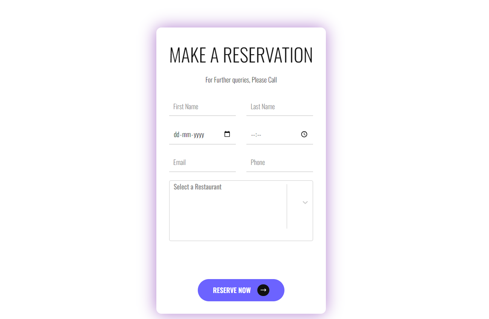

# Restaurant Reservation System

This project is a restaurant reservation system that allows users to make reservations at various restaurants. It includes both frontend and backend components, providing a complete solution for managing restaurant reservations.

## Features

- **User Registration**: Users can register using their name, email, phone number, and select a restaurant for reservation.
- **Reservation Form**: Includes fields for entering personal details, reservation date and time, and selecting a restaurant from a dropdown list.
- **Validation**: Frontend and backend validation to ensure all required fields are filled and data is in the correct format.
- **Error Handling**: Comprehensive error handling to provide meaningful feedback to users in case of issues.
- **Responsive Design**: Responsive UI to ensure a seamless experience across different devices.

## Future Aspects

- **Payment Integration**: Implement payment gateways to allow users to prepay or pay at the restaurant upon reservation.
- **Order Placement**: Extend functionality to enable users to place orders in advance along with their reservation.
- **Admin Dashboard**: Create an admin interface to manage reservations, view analytics, and update restaurant information.
- **Email Notifications**: Send email confirmations upon successful reservation and reminders closer to the reservation date.
- **User Profiles**: Allow users to create profiles to manage their reservations and preferences easily.

## Technologies Used

- **Frontend**: React.js, Axios, React Router, React Select, Toastify
- **Backend**: Node.js, Express.js, MongoDB , Axios
- **Others**: Vite (frontend development server)
## ScreenShots
>A graphical overview of some components of the web application,

1. **Landing Page**


2. **Service**


3. **Reservation Page**


## Setup Instructions

### Prerequisites

- Node.js (v14.x or later)
- MongoDB (Atlas or local instance)

### Installation

1. **Clone the repository**

   ```bash
   git clone <repository-url>
   cd frontend  // Navigate to the frontend directory
   npm install   // Install frontend dependencies
   cd ..  // Navigate back to the main project directory
   cd backend  // Navigate to the backend directory
   npm install  // Install backend dependencies

2. **Start the backend server**

   ```bash
    npm start
>Starts the backend server (runs on http://localhost:4000 by default).


3. **Start the frontend development server**

   ```bash
    cd frontend  #If not already in the frontend directory
    npm run dev
>Starts the frontend server (runs on http://localhost:3000 by default).


